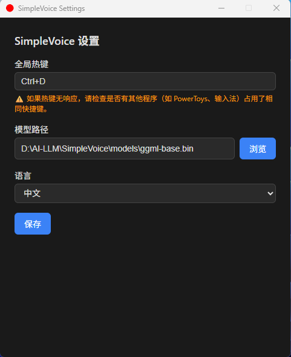
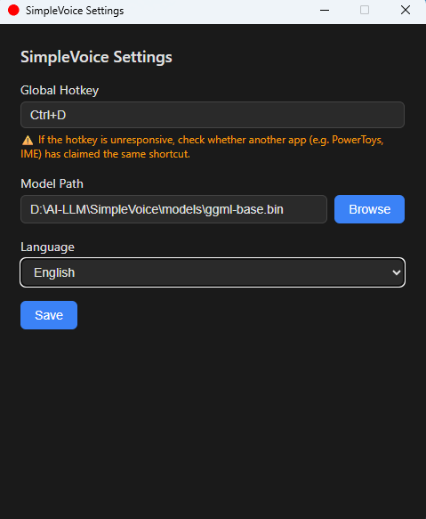
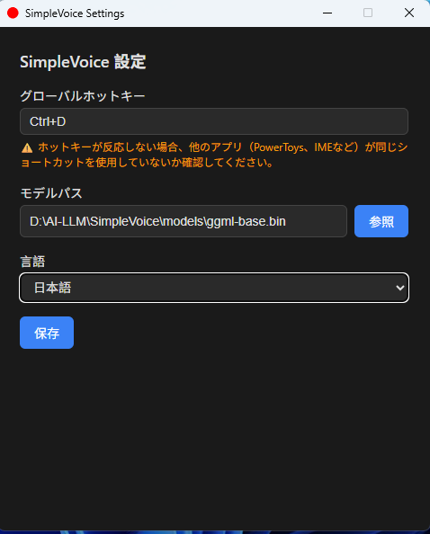
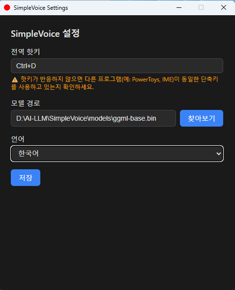

# SimpleVoice - Free Speech Recognition Tool

[](LICENSE)
[](https://github.com/tigermask1978/simplevoice/stargazers)


A privacy-first, cross-platform desktop voice input tool. Press a global hotkey, speak, release — transcribed text is injected at your cursor. Everything runs locally via [whisper.cpp](https://github.com/ggerganov/whisper.cpp); no cloud, no telemetry, no audio stored to disk.

---

## Features

- **CPU-only inference** — No GPU required, runs on most computers
- **Global hotkey** — hold to record, release to transcribe and inject
- **Local transcription** — whisper.cpp runs entirely on your machine
- **Text injection** — types result at cursor in any application
- **Multi-language** — Chinese, English, Japanese, Korean, or auto-detect
- **System tray** — runs in background, tray icon shows recording state
- **First-run onboarding** — guides you through model download on first launch
- **Internationalization (i18n) support** — Supports multiple languages and localized interface

## 📷 Screenshots







## Prerequisites

| Tool | Version | Notes |
|------|---------|-------|
| [Rust](https://rustup.rs/) | stable | `rustup update stable` |
| [Node.js](https://nodejs.org/) + [pnpm](https://pnpm.io/) | Node ≥18 | `npm i -g pnpm` |
| [LLVM](https://releases.llvm.org/) | any recent | Required by `whisper-rs` bindgen |
| Whisper GGML model | — | See [Model Download](#model-download) |

After installing LLVM, set the environment variable:

```bash
# Windows (PowerShell)
$env:LIBCLANG_PATH = "C:\Program Files\LLVM\bin"

# or add to your system environment variables permanently
```

## Model Download

Place a GGML/GGUF model file in the `models/` directory:

```bash
# Using the provided script (Linux/macOS/Git Bash)
bash scripts/download_model.sh small   # ~466 MB, recommended
bash scripts/download_model.sh base    # ~142 MB, faster
bash scripts/download_model.sh tiny    # ~75 MB, fastest
```

Or download manually from [HuggingFace ggerganov/whisper.cpp](https://huggingface.co/ggerganov/whisper.cpp/tree/main) and place the `.bin` file in `models/`.

## Quick Start

```bash
# Install frontend dependencies
pnpm install

# Run in development mode
pnpm tauri dev

# Build for production
pnpm tauri build
```

## Usage

1. Launch SimpleVoice — it minimizes to the system tray
2. Open **Settings** from the tray menu to configure:
   - **Hotkey** — click the field and press your desired key combination
   - **Model** — browse to your downloaded `.bin` file
   - **Language** — select transcription language or auto-detect
3. Hold the hotkey to record, release to transcribe
4. Transcribed text is typed at your cursor automatically

## Development

```bash
# Rust checks
cd src-tauri && cargo fmt && cargo clippy

# Frontend checks
pnpm lint && pnpm typecheck

# Tests
cd src-tauri && cargo test
pnpm test
```

## Tech Stack

- **Frontend**: Tauri v2 + React 18 (TypeScript)
- **Backend**: Rust — `whisper-rs`, `cpal`, `rubato`, `enigo`
- **Hotkey**: `tauri-plugin-global-shortcut`
- **Audio**: captured in-memory, resampled to 16 kHz mono, never written to disk

## Privacy

SimpleVoice is designed to be fully offline:

- No network requests during transcription
- Audio is processed in memory and discarded immediately
- No usage data or telemetry collected
- Config stored locally at `~/.config/simple-voice/config.json`


## ❤️ Support the Developer

If **SimpleVoice** has helped you, please consider making a **voluntary donation**.  
Your support helps me maintain the project, improve the models, and add new features.

**Donate via PayPal:**

[💰 Donate with PayPal](https://www.paypal.com/paypalme/tigermask1978)

Even a small donation is greatly appreciated!  
⭐ Starring the repository also helps a lot.
